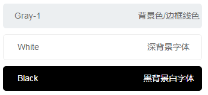
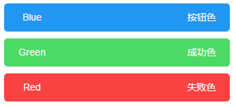
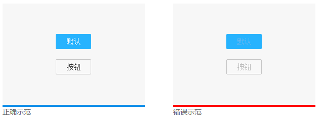
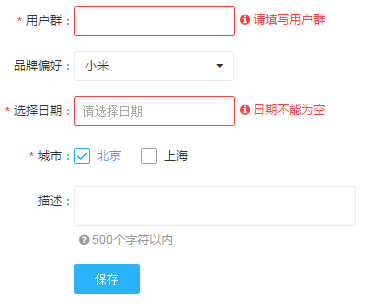

色彩
=============
设计中对色彩的运用不仅应考虑品牌的识别性，还需达到信息传递、操作指引、交互反馈，或是强化和凸显某一个元素的目的。基于操作系统更注重高效、清晰等特点，Bocom UI 的用色上更偏向简洁实用一些。在选择色彩时有以下三个注意点：

1. 色彩应与产品定位相匹配，且符合用户心理认知；
2. 视觉层次应清晰分明，为重要行动点或关键信息定义一个主色，并建立视觉连续性；
3. 遵守 WCAG 2.0 的 标准，保证足够的对比度，让色彩更容易被视障碍（色盲）用户识别。

## 中性色边框和背景色
灰色作为中性色在 BocomUI 的网页设计中被大量使用到，它的使用有利于关键内容的衬托和功能的引导。这类色彩主要体现在导航框架、背景底色、描边、或次级操作等等。

中性色边框和背景色示例

## 提示信息色
比较稳定的色彩除了中性色外还有具备特定含义的功能色，这类色彩起到传递功能信息、代表某种状态等作用。

提示信息色示例

## 首选按钮
可以在按钮中包括一个图像和相关的文本，用它们在按钮中创建一个吸引人的标记图像

首选按钮色示例

## 对比度
当对比度数值低于 3:1 时，弱视用户将很难识别

对比度示例

## 必填字段色
通常必须填写的表单字段会用色彩（比如红色）来进行区分。

必填字段色示例

