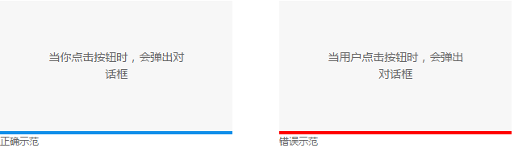
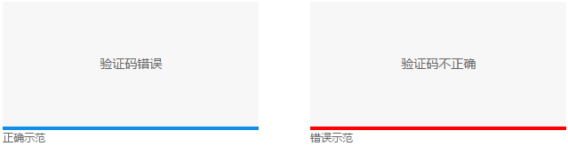
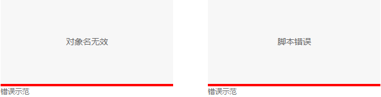
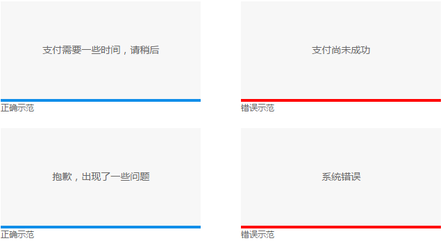
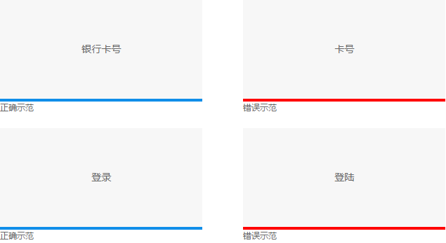
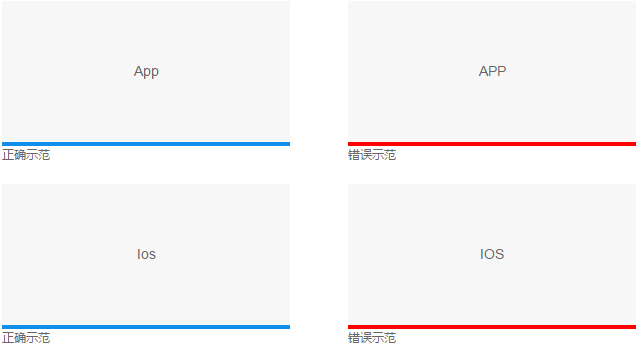
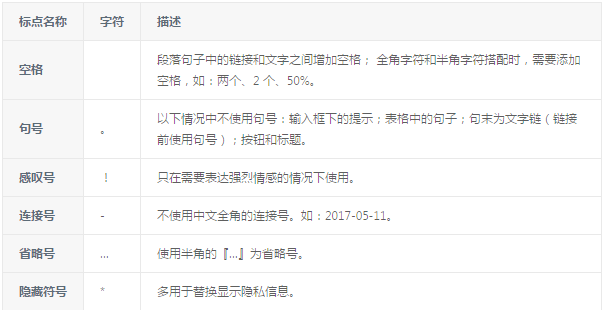

文案
=============
##  面对用户，尽量用第二人称
人称的选择，体现了设计师是如何看待用户的。

一般来说，设计师会把用户当做一个虚拟的第三方，描述他们时往往是“用户”、“他们”，然而UI界面是以界面为媒介、与用户的直接对话，是和一个真实人类面对面的沟通。

在现实生活中，会称面前的人为“你”“您”，那在UI界面中也应称用户为“你”“您”，而不应使用第三人称“用户”“他们”。
使用第二人称，体现了与用户的近距离感，让UI界面成为一个拟人的人格，能够让用户沉浸在模拟真实对话的情境中，更有利于我们指引和鼓励用户操作。

例如：
  “当你点击按钮时，会弹出对话框” 优于“当用户点击按钮时，会弹出对话框”。

  

##  简单、直接
文案应直接，单刀直入，最大限度的降低用户的理解负担。

间接、暧昧模糊的说法，生僻和过于“文雅”的用词，都应尽量避免，因为UI文案只是沟通的工具，只有最有效的传递信息才是它的任务。
简单来讲，就是大白话，使用日常常用词，平铺直叙。
以形容词来说，“肯定的表达”比“否定的否定”更直接。

例如：“验证码错误”优于“验证码不正确”。

  

##  讲用户能懂的话
把用户与界面的所有交互，都当成人与人沟通来看，提醒文案便更人性化一些。简言之，说人话。

例如：不要写“对象名 XXX 无效”、“XXX 脚本错误”。

  

 站在用户的角度，说用户熟悉的话。

##  语气、尊重和委婉
十几年前，设计师们的主要工作确实很大比例为视觉设计，因此被粗暴地称之为「美工」。但今日世界已截然不同，把设计师细分出来就有用户体验设计、视觉设计、产品设计等，所以仍然称设计师为「美工」，毫无道理，甚至，就像知乎上有人说的：

对于设计师来说，「美工」是侮辱性的称呼，就像「代码民工」之于程序员一样。

在文案的使用上，对于某个群体的称呼是否恰当，取决于写者是否了解这个该词的真正含义。

再有，像「您」和「你」这种问题，其实没有统一标准，得看产品本身想要以哪种姿态来面对用户。

文案有时候并不是为了某个目的和功能，而是为了隐藏不能明说的原因和问题，或者只为了安抚用户情感，这时文案就不能那么生硬直接。以委婉或者暧昧的文字来向用户说明，暗示或引导用户从我们希望的角度去理解。

例如，“支付需要一些时间，请稍候”优于“支付尚未成功”；
“抱歉，出现了一些问题，请稍后刷新重试”优于“系统错误”。

  

##  用词准确
通用基本用词要规范，不要写错字，词语表达要完整。
专业用语要精准，并是所属行业认可通用用词；时间的表述必须明确。

例如：银行卡号与卡号 ;登录与登陆。

  

 可能因为绝大部分人都在用 PowerPoint 来制作幻灯片，所以，通常人们会直接使用「PPT」这个词来代指幻灯片。但你知道，能做幻灯片的还有 Keynote、Prezi

##  英文名词大和小写
正确使用专有名词的大小写规范。

例如 正确：App，错误：APP；正确：Ios，错误：IOS、ios。

  

##  标点符号规范
正确得使用标点符号会让句子看起来更清晰和具有可读性。

  
