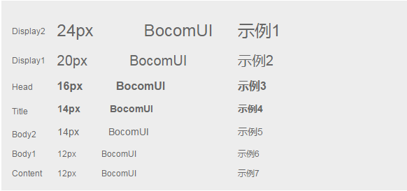
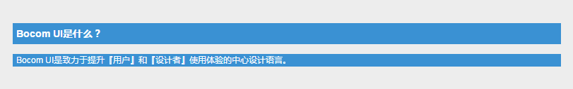
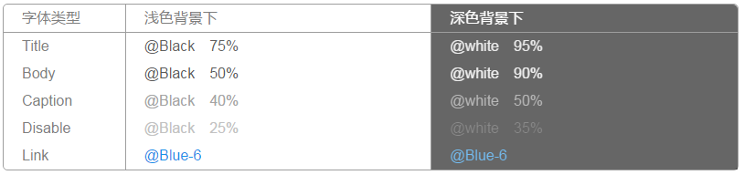

字体
=============
跨平台的字体设定，力求在各个操作系统下都有最佳展示效果。

## 字体
字体是界面设计中最重要的基本构成之一，用户通过文本来消化内容和完成工作，优雅的字体将大大提升用户的阅读体验及工作效率。Bocom UI 的字体方案，在满足不同终端始终保持良好的阅读体验的同时，使页面的视觉层次更加清晰。使用时有以下三点需要注意：

1. 合理的使用不同的字重、字号和颜色来强调界面中最重要的信息；
2. 尽可能的使用单种字体，混合使用多种字体会让界面看起来零散和草率；
3. 遵循 WCAG 2.0 标准，字体在使用时与背景颜色的对比值满足无障碍阅读的最低标准。

**font-family:** "PingFangSC-Thin", "Lantinghei SC", "Open Sans", Arial, "Hiragino Sans GB", "Microsoft YaHei","\5FAE\8F6F\96C5\9ED1", "STHeiti", "WenQuanYi Micro Hei", SimSun, sans-serif

## 字号
=============
Bocom UI使用不同的字号和字重来传递视觉的信息层次。默认字体为 12pt，展示型页面可以设置为 14pt，其他字体字号相应升级。

## 行高
=============
行高会影响阅读的体验，西文的基本行高通常是字号的 14px 上下，而中文因为字符密实且高度一致，所以一般行高需要更大，1.5em 至 1.8em 之间是一个比较好的视觉阅读效果，BocomUI 规定默认文案字体行高为 1.5em，展示型页面可根据实际情况调整行高。

第一行高是21px , 字体大小是16px ; 第二行高是18px , 字体大小是12px。

## 字体颜色
=============
文本颜色如果和背景颜色太接近就会很难以阅读，这对于深色背景和浅色背景同样适用。
考虑到无障碍设计的需求，帮助那些弱视和色盲的用户也能轻松识别和阅读屏幕上的文字，我们参考了 WACG 2.0 的标准，文本和背景色之间至少保持最小 4.5:1 的对比度（AA 级），正文内容都保持了 7:1 以上的 AAA 级对比度。

