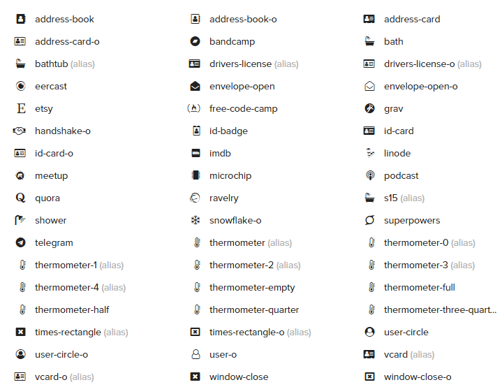
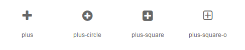
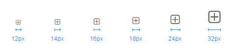
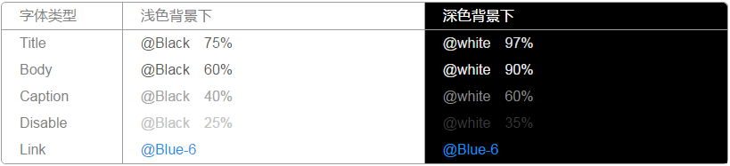

# 图标

图标是具有指代意义的图形，也是一种标识。通过使用图标表达命令，强调状态，表示产品或类别。为了系统及跨平台之间图形认知保持一致， Bocom UI的图标在设计和使用时有以下两个原则点需要注意：

1. 简单的图形语言以及高辨识度。清晰、直观的图标更能明确指代含义便于识别记忆；
2. 保持图标之间一致的风格和表现方式。界面中的所有图标都应该在细节设计、透视和笔画权重上保持一致。

## 图标

部分图标示例

## 命名规则

统一的命名方式有助于管理图标，也能更快速的找到需要的图标。我们为每个图标赋予了语义化的命名，命名规则如下:
1. 实心和描线图标保持同名，用`-o` 来区分，比如 question-circle（实心） 和 question-circle-o（描线）
2. 命名顺序：[图标名]-[形状?]-[描线?]-[方向?]

 ? 为可选

命名示例

## 图标尺寸
应用于页面时请使用 BocomUI 的规范尺寸，与字体搭配时和字体的尺寸保持一致。
例如：和 12pt 字体搭配时，图标使用 12px，图标与文字的间距为 8px。

尺寸示例

## 颜色
图标的颜色需要与搭配文案的色值保持一致（表示状态的除外）。

颜色示例
