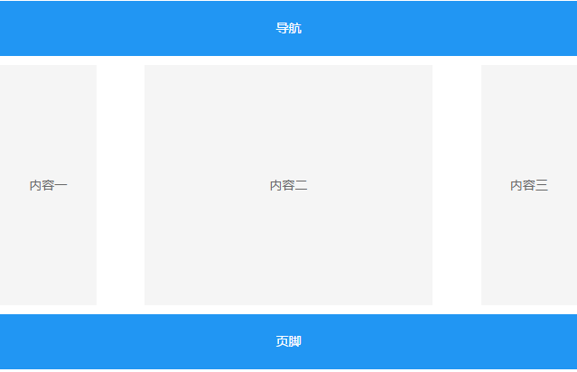
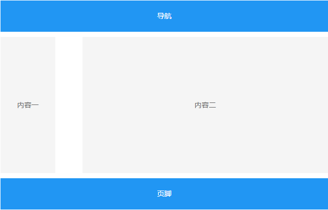
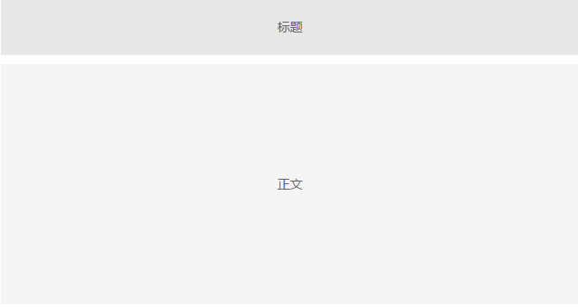
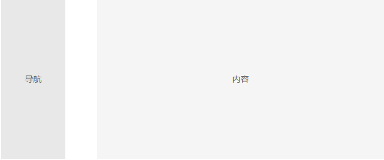
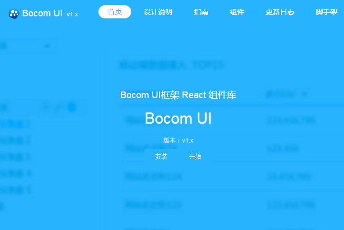

布局
=============

布局是页面构成的前提，是后续展开交互和视觉设计的基础。Bocom UI 提供了常用的布局模板来保证同类产品间的一致性，设计者在选择布局之前，需要注意以下几点原则：

1. 明确用户在此场景中完成的主要任务和需获取的决策信息。
2. 明确决策信息和操作的优先级及内容特点，选择合理布局。

网页常见的布局结构有“国”字型布局、拐角型布局、标题正文型布局、左右框架型布局、POP型布局等

##  “国”字型
是一些大型网站所喜欢的类型，即最上面是网站的标题以及横幅广告条，接下来就是网站的主要内容，左右分列两小条内容，中间是主要部分，与左右一起罗列到底，最下面是网站的一些基本信息、联系方式、版权声明等。这种结构是我们在网上见到的差不多最多的一种结构类型。

国字型示例

##  拐角型
这种结构与上一种其实只是形式上的区别，它去掉了“国”字形布局的最右边的部分，给主内容区释放了更多空间。这种布局上面是标题及广告横幅，接下来的左侧是一窄列链接等，右列是很宽的正文，下面也是一些网站的辅助信息。

拐角型示例

##  标题正文型

这种类型即最上面是标题或类似的一些东西，下面是正文，比如一些文章页面或注册页面等就是这种类

标题正文型示例

##  左右框架型
这是一种左右为分别两页的框架结构，一般左面是导航链接，有时最上面会有一个小的标题或标致，右面是正文。我们见到的大部分的大型论坛都是这种结构的，有一些企业网站也喜欢采用。这种类型结构非常清晰，一目了然。

左右框架型示例

##  POP型
POP引自广告术语，就是指页面布局像一张宣传海报，以一张精美图片作为页面的设计中心。常用于时尚类站点。优点显而易见：漂亮吸引人。缺点就是速度慢。作为版面布局，还是值得借鉴的。
POP型还可以使用一个Flash页面作为封面，这种布局是指整个网页就是一个Flash动画，它本身就是动态的，画面一般比较绚丽、有趣，是一种比较新潮的布局方式。由于Flash强大的功能，页面所表达的信息比普通封面型更丰富，其视觉效果及听觉效果如果处理得当，会是一种非常有魅力的布局。

POP型示例
