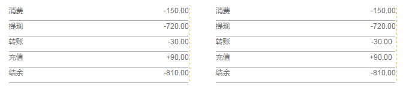

# 对齐

正如『格式塔学派』中的连续律（Law of Continuity）所描述的，在知觉过程中人们往往倾向于使知觉对象的直线继续成为直线，使曲线继续成为曲线。在界面设计中，将元素进行对齐，既符合用户的认知特性，也能引导视觉流向，让用户更流畅地接收信息

## 文案类对齐
如果页面的字段或段落较短、较散时，需要确定一个统一的视觉起点。

推荐左侧示例，标题和正文左对齐，使用了一个视觉起点。
不推荐右侧示例，标题和正文使用了两个视觉起点，除非刻意强调两者区别。

## 表单类对齐
冒号对齐（右对齐）能让内容锁定在一定范围内，让用户眼球顺着冒号的视觉流，就能找到所有填写项，从而提高填写效率。

冒号对齐示例

## 数字类对齐
为了快速对比数值大小，建议所有数值取相同有效位数，并且右对齐。

左侧为正确示例，右侧为错误示例
