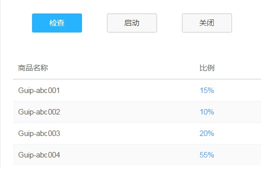

对比
=============
对比是增加视觉效果最有效方法之一，同时也能在不同元素之间建立一种有组织的层次结构，让用户快速识别关键信息。

## 主次关系对比
为了让用户能在操作上（类似表单、弹出框等场景）快速做出判断， 来突出其中一项相对更重要或者更高频的操作。

左侧为正确示例，右侧为错误示例。

在一些需要用户慎重决策的场景中，系统应该保持中立，不能替用户或者诱导用户做出判断。

不区分主次的示例。
『通过』和『驳回』都使用次按钮，系统保持中立。

## 总分关系对比
通过调整排版、字体、大小等方式来突出层次感，区分总分关系，使得页面更具张力和节奏感。

总分关系示例1

总分关系示例2
