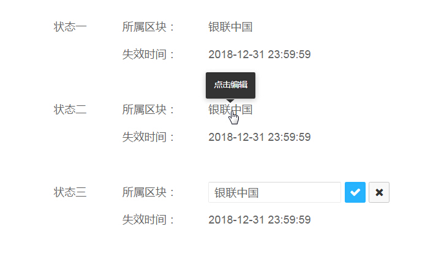

直截了当
=============
正如 Alan Cooper 所言：『需要在哪里输出，就要允许在哪里输入』。这就是直接操作的原理。eg：不要为了编辑内容而打开另一个页面，应该直接在上下文中实现编辑。

## 页内编辑
### 单字段行内编辑

当『易读性』远比『易编辑性』重要时，可以使用『单击编辑』。

### 单击编辑示例

状态一：普通的浏览模式，不区分可编辑行和不可编辑行；

状态二：鼠标悬停时，『指针』变为『手型』，编辑区域底色变黄，出现『Tooltips』提示单击编辑；

状态三：鼠标点击后，出现『输入框』、『确定』、『取消』表单元素，同时光标定位在『输入框』中。

当『易读性』为主，同时又要突出操作行的『易编辑性』时，可使用『文字链/图标编辑』。

### 文字链/图标编辑示例

状态一：在可编辑行附近出现文字链/图标；

状态二：鼠标点击『编辑』后，出现『输入框』、『确定』、『取消』表单元素，同时光标定位在『输入框』中。

### 多字段行内编辑

多字段行内编辑示例

可在段内直接编辑

