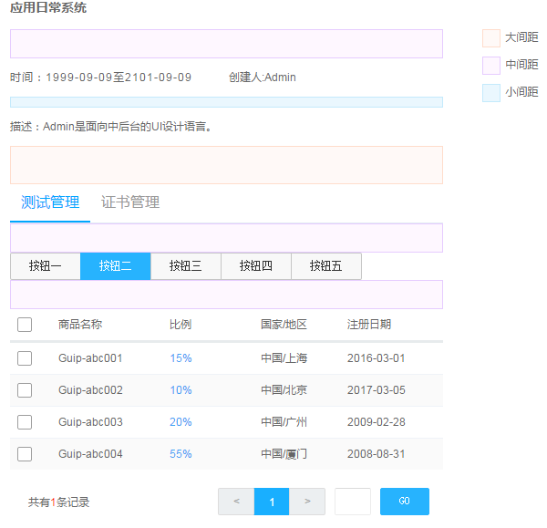

亲密性
=============
如果信息之间关联性越高，它们之间的距离就应该越接近，也越像一个视觉单元；反之，则它们的距离就应该越远，也越像多个视觉单元。亲密性的根本目的是实现组织性，让用户对页面结构和信息层次一目了然

## 纵向间距关系
通过『小号间距』、『中号间距』、『大号间距』这三种规格来划分信息层次。

在这三种规格不适用的情况下，可以通过加减『基础间距』的倍数，或者增加元素来拉开信息层次。

纵向间距示例：通过上图的三种颜色来判断间距大小

## 横向间距关系
为了适用不同尺寸的屏幕，在横向采用栅格布局来排布组件，从而保证布局的灵活性。

在一个组件内部，元素的横向间距也应该有所不同。

示例一：

从视觉上通用户名和外网IP来确定左右元素之间的间距

示例二：

名称左对齐、多选框右对齐对比突显左右元素之间的间距
