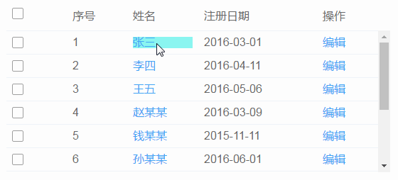

# 简化交互

根据费茨法则（Fitts's Law）所描述的，如果用户鼠标移动距离越少、对象相对目标越大，那么用户越容易操作。
通过运用上下文工具（即：放在内容中的操作工具），使内容和操作融合，从而简化交互。

## 实时可见工具
如果某个操作非常重要，就应该把它放在界面中，并实时可见。

实时可见工具示例：

状态一： 文案中出现明显的可点击图标

状态二： 鼠标悬停时，鼠标指针变为手型，颜色加深

状态三： 鼠标点击后，和未点击前有明显的区别（5→6）

## 开关显示工具
如果某些操作只需要在特定模式时显示，可以通过开关来实现。

开关显示工具示例：

点击修改后，文本变为输入框，进入编辑状态

## 交互中的工具
如果操作不重要或者可以通过其他途径完成时，可以将工具放置在用户的操作流程中，减少界面元素，降低认知负担，给用户小惊喜。

鼠标悬停时，Tooltip进行提示，用户点击文本可以进行编辑

## 可视区域 ≠ 可点击区域
在使用 Table 时，文字链的点击范围受到文字长短影响，可以设置整个单元格为热区，以便用户触发。

当悬浮在 ID 所在的文字链单元格时，鼠标『指针』随即变为『手型』，单击即可跳转。

当需要增强按钮的响应性时，可以通过增加用户点击热区的范围，而不是增大按钮形状，从而增强响应性，又不缺失美感。

鼠标移入按钮附近，即可激活 Hover 状态。

