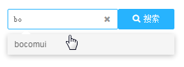
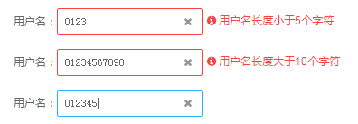
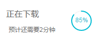

# 即时反应

『即时反应』的重要性体现在交互之后立即给出反馈。

就像『牛顿第三定律』所描述作用力和反作用一样，用户进行了操作或者内部数据发生了变化，系统就应该立即有一个对应的反馈，同时输入量级越大、重要性越高，那么反馈量级越大、重要性越高。

虽然反馈太多（准确的说，错误的反馈太多）是一个问题，但是反馈太少甚至没有反馈的系统，则让人感觉迟钝和笨拙，用户体验更差。

## 查询模式
自动完成：用户输入时，下拉列表会随着输入的关键词显示匹配项。

用户查询的关键词，如果部分匹配上预留关键词，可以自动完成

## 反馈模式

### 实时预览

在用户提交输入之前，让他先行了解系统将如何处理他的输入。

实时预览示例

根据用户的输入，提供关于用户名长度和有效性的实时反馈

### 进度指示
当一个操作需要一定时间完成时，就需要即时告知进度，保持与用户的沟通。 常见的进度指示：『按钮加载』、『表格加载』、文件下载』。可根据操作的量级和重要性，展示不同类型的进度指示。

按钮加载示例

表格加载示例

文件下载示例

