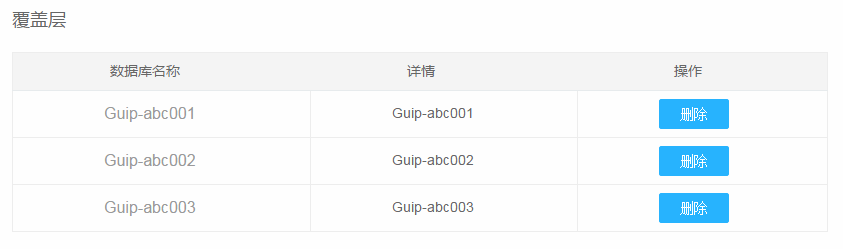
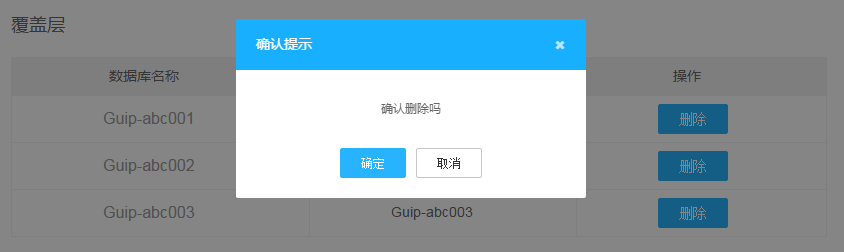
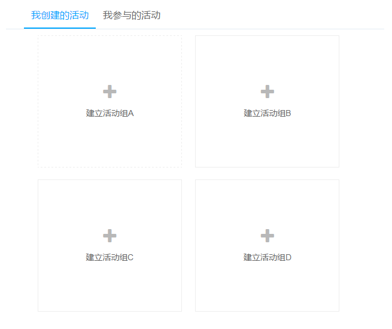

足不出户
=============
能在这个页面解决的问题，就不要去其它页面解决，因为任何页面刷新和跳转都会引起变化盲视（Change Blindness），导致用户心流（Flow）被打断。
频繁的页面刷新和跳转，就像在看戏时，演员说完一行台词就安排一次谢幕一样。

## 覆盖层

一般在列表中，通过用户『点击』某个区块，点击可弹出确认框，确认是否执行该操作

用户点击『删除』后，弹窗进行确认，在当前页面完成任务

当用户点击确定按钮完成任务后，弹窗消失，完成操作。

## 标签页
将多个平级的信息进行整理和分类了。

标签页一次只显示一组信息。
